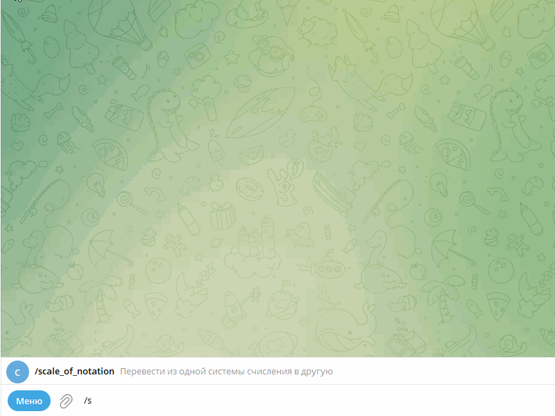
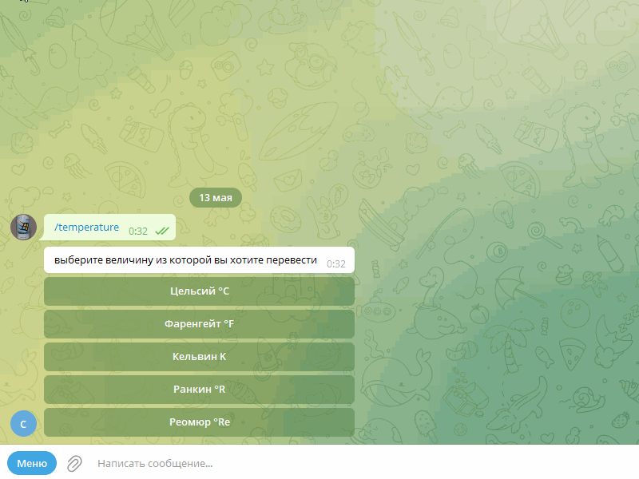
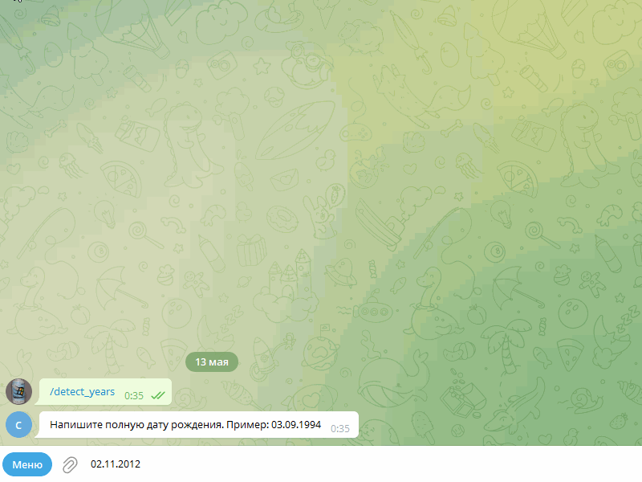
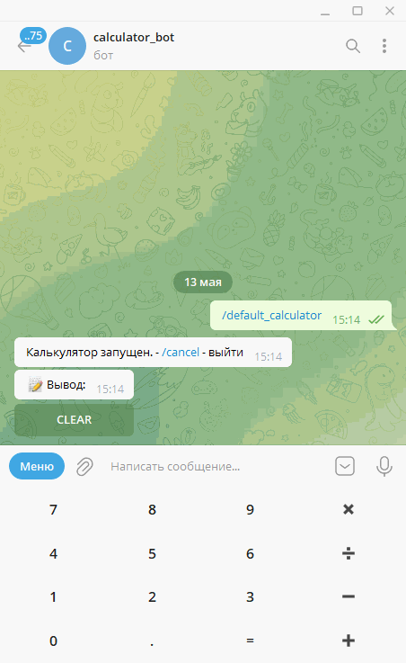
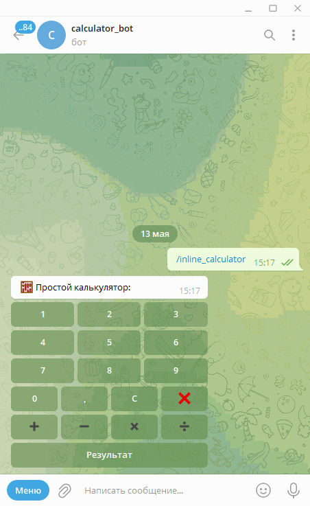

# Конвертер бот  

Написан с помощью библиотеки Aiogram в целях обучения 

## Примеры возможностей

#### конвертер валют 

#### Системы счисления 

#### Конвертер температуры

#### Определение возраста и кол-ва дней до следующего дня рождения

### обычный и инлайн калькулятор 
<code>

    
    

</code>

## Установка

1. Создайте локально каталог и перейдите в него

2. Клонируйте в текущую директорию (точка в конце)

> git clone https://github.com/meys313/converter_bot.git .

### 2. Создать виртуальное окружение:

> python -m venv venv

> source venv/bin/activate

> pip install --upgrade pip

### 3. Установите все зависимости 

> pip install -r ./requirements.txt

### 4. Создать файл с переменными окружения ".env" в корне
    внесите данные по шаблону:

    ADMINS= ваш id telegram
    BOT_TOKEN=5181660672#AEqj2xGlfqNEqdss4V6Vib7hmNTMZtUsIp2q # токен вашего бота
    ip=localhost

### 5. Запустите app.py 

